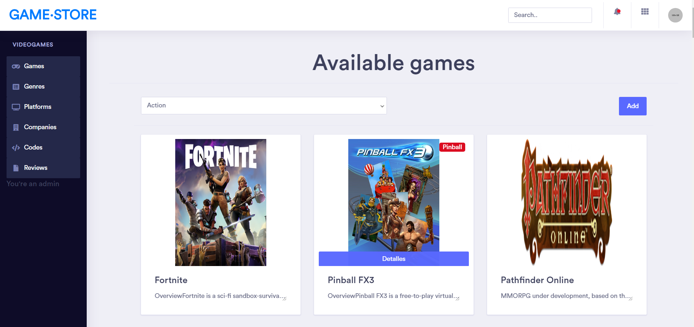
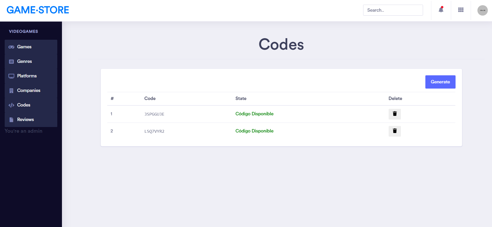

# Laravel VideoGame Store


## Screenshots

### Videogames catalog

### Videogame details and reviews

### Game codes administration



## Installation

### Setup database

In order to run this app in localhost you must setup the database first and populate it with initial data.
You must setup the `gamestore` database first, **I used Postgres in my case:**

```sql
create database gamestore
```
If you want to use another DB name change it in the `.env` file along with credentials

#### Enable driver

Enable the appropriate driver for your database manager. In my case i had to uncomment these lines in the `php.ini` file:
```
extension=pdo_pgsql
extension=pgsql
```

#### Make migrations

```
php artisan migrate
```

#### Populate database

We create some test data to fill the database and make it easier to explore the application, to use that data you must run:
```
php artisan db:seed
```

### Dependencies

Install project dependencies with composer (this can take a long time):
```php
composer install
```

## Start server
```
php artisan serve
```


## Documentation

### Routes

|      View                 |           Folder             |     Asociated View   |
| -----------------------:  | :--------------------------: | :------------------- |
| login.blade.php           | resources/views/vg/auth      | login                |
| game_index.blade.php      | resources/views/vg/game      | games                |
| show_game.blade.php       | resources/views/vg/game      | games/show/{id}      |
| platform_index.blade.php  | resources/views/vg/platform  | platforms            |
| show_platform.blade.php   | resources/views/vg/platform  | platforms/show/{id}  |
| character_index.blade.php | resources/views/vg/character | characters           |
| show_character.blade.php  | resources/views/vg/character | characters/show/{id} |
| company_index.blade.php   | resources/views/vg/company   | companies            |
| show_company.blade.php    | resources/views/vg/company   | companies/show/{id}  |
| review_index.blade.php    | resources/views/vg/review    | reviews              |
| show_review.blade.php     | resources/views/vg/review    | reviews/show/{id}    |
| genre_index.blade.php     | resources/views/vg/genre     | genres               |
| show_genre.blade.php      | resources/views/vg/genre     | genres/show/{id}     |


| Method    | URI                         | Name               | Action                                                                 | Middleware |
| :-------- | :-------------------------- | :----------------- | :--------------------------------------------------------------------- | :--------- |
| POST      | /                           | store              | App\Http\Controllers\VG\GameController@store                           | web,auth  |
| GET|HEAD  | /                           | index              | App\Http\Controllers\VG\GameController@index                           | web,auth  |
| GET|HEAD  | api/user                    |                    | Closure                                                                | api,auth:api |
| GET|HEAD  | characters                  | characters.index   | App\Http\Controllers\VG\CharacterController@index                      | web,auth  |
| POST      | characters                  | characters.store   | App\Http\Controllers\VG\CharacterController@store                      | web,auth  |
| GET|HEAD  | characters/create           | characters.create  | App\Http\Controllers\VG\CharacterController@create                     | web,auth  |
| DELETE    | characters/{character}      | characters.destroy | App\Http\Controllers\VG\CharacterController@destroy                    | web,auth  |
| PUT|PATCH | characters/{character}      | characters.update  | App\Http\Controllers\VG\CharacterController@update                     | web,auth  |
| GET|HEAD  | characters/{character}      | characters.show    | App\Http\Controllers\VG\CharacterController@show                       | web,auth  |
| GET|HEAD  | characters/{character}/edit | characters.edit    | App\Http\Controllers\VG\CharacterController@edit                       | web,auth  |
| GET|HEAD  | codes                       | codes.index        | App\Http\Controllers\VG\CodeController@index                           | web,auth |
| POST      | codes                       | codes.store        | App\Http\Controllers\VG\CodeController@store                           | web,auth |
| GET|HEAD  | codes/create                | codes.create       | App\Http\Controllers\VG\CodeController@create                          | web,auth |
| PUT|PATCH | codes/{code}                | codes.update       | App\Http\Controllers\VG\CodeController@update                          | web,auth |
| DELETE    | codes/{code}                | codes.destroy      | App\Http\Controllers\VG\CodeController@destroy                         | web,auth |
| GET|HEAD  | codes/{code}                | codes.show         | App\Http\Controllers\VG\CodeController@show                            | web,auth |
| GET|HEAD  | codes/{code}/edit           | codes.edit         | App\Http\Controllers\VG\CodeController@edit                            | web,auth |
| POST      | companies                   | companies.store    | App\Http\Controllers\VG\CompanyController@store                        | web,auth |
| GET|HEAD  | companies                   | companies.index    | App\Http\Controllers\VG\CompanyController@index                        | web,auth |
| GET|HEAD  | companies/create            | companies.create   | App\Http\Controllers\VG\CompanyController@create                       | web,auth |
| GET|HEAD  | companies/{company}         | companies.show     | App\Http\Controllers\VG\CompanyController@show                         | web,auth |
| PUT|PATCH | companies/{company}         | companies.update   | App\Http\Controllers\VG\CompanyController@update                       | web,auth |
| DELETE    | companies/{company}         | companies.destroy  | App\Http\Controllers\VG\CompanyController@destroy                      | web,auth |
| GET|HEAD  | companies/{company}/edit    | companies.edit     | App\Http\Controllers\VG\CompanyController@edit                         | web,auth |
| GET|HEAD  | create                      | create             | App\Http\Controllers\VG\GameController@create                          | web,auth |
| GET|HEAD  | games                       | games.index        | App\Http\Controllers\VG\GameController@index                           | web,auth |
| POST      | games                       | games.store        | App\Http\Controllers\VG\GameController@store                           | web,auth |
| GET|HEAD  | games/create                | games.create       | App\Http\Controllers\VG\GameController@create                          | web,auth |
| GET|HEAD  | games/{game}                | games.show         | App\Http\Controllers\VG\GameController@show                            | web,auth |
| DELETE    | games/{game}                | games.destroy      | App\Http\Controllers\VG\GameController@destroy                         | web,auth |
| PUT|PATCH | games/{game}                | games.update       | App\Http\Controllers\VG\GameController@update                          | web,auth |
| GET|HEAD  | games/{game}/edit           | games.edit         | App\Http\Controllers\VG\GameController@edit                            | web,auth |
| GET|HEAD  | genres                      | genres.index       | App\Http\Controllers\VG\GenreController@index                          | web,auth |
| POST      | genres                      | genres.store       | App\Http\Controllers\VG\GenreController@store                          | web,auth |
| GET|HEAD  | genres/create               | genres.create      | App\Http\Controllers\VG\GenreController@create                         | web,auth |
| GET|HEAD  | genres/{genre}              | genres.show        | App\Http\Controllers\VG\GenreController@show                           | web,auth |
| DELETE    | genres/{genre}              | genres.destroy     | App\Http\Controllers\VG\GenreController@destroy                        | web,auth |
| PUT|PATCH | genres/{genre}              | genres.update      | App\Http\Controllers\VG\GenreController@update                         | web,auth |
| GET|HEAD  | genres/{genre}/edit         | genres.edit        | App\Http\Controllers\VG\GenreController@edit                           | web,auth |
| POST      | login                       |                    | App\Http\Controllers\Auth\LoginController@login                        | web,guest |
| GET|HEAD  | login                       | login              | App\Http\Controllers\Auth\LoginController@showLoginForm                | web,guest |
| POST      | logout                      | logout             | App\Http\Controllers\Auth\LoginController@logout                       | web |
| POST      | password/confirm            |                    | App\Http\Controllers\Auth\ConfirmPasswordController@confirm            | web,auth |
| GET|HEAD  | password/confirm            | password.confirm   | App\Http\Controllers\Auth\ConfirmPasswordController@showConfirmForm    | web,auth |
| POST      | password/email              | password.email     | App\Http\Controllers\Auth\ForgotPasswordController@sendResetLinkEmail  | web |
| GET|HEAD  | password/reset              | password.request   | App\Http\Controllers\Auth\ForgotPasswordController@showLinkRequestForm | web |
| POST      | password/reset              | password.update    | App\Http\Controllers\Auth\ResetPasswordController@reset                | web |
| GET|HEAD  | password/reset/{token}      | password.reset     | App\Http\Controllers\Auth\ResetPasswordController@showResetForm        | web |
| GET|HEAD  | platforms                   | platforms.index    | App\Http\Controllers\VG\PlatformController@index                       | web,auth |
| POST      | platforms                   | platforms.store    | App\Http\Controllers\VG\PlatformController@store                       | web,auth |
| GET|HEAD  | platforms/create            | platforms.create   | App\Http\Controllers\VG\PlatformController@create                      | web,auth |
| GET|HEAD  | platforms/{platform}        | platforms.show     | App\Http\Controllers\VG\PlatformController@show                        | web,auth |
| PUT|PATCH | platforms/{platform}        | platforms.update   | App\Http\Controllers\VG\PlatformController@update                      | web,auth |
| DELETE    | platforms/{platform}        | platforms.destroy  | App\Http\Controllers\VG\PlatformController@destroy                     | web,auth |
| GET|HEAD  | platforms/{platform}/edit   | platforms.edit     | App\Http\Controllers\VG\PlatformController@edit                        | web,auth |
| PUT       | purchase                    | purchase           | App\Http\Controllers\VG\CodeController@purchase                        | web,auth |
| POST      | register                    |                    | App\Http\Controllers\Auth\RegisterController@register                  | web,guest |
| GET|HEAD  | register                    | register           | App\Http\Controllers\Auth\RegisterController@showRegistrationForm      | web,guest |
| GET|HEAD  | reviews                     | reviews.index      | App\Http\Controllers\VG\ReviewController@index                         | web,auth |
| POST      | reviews                     | reviews.store      | App\Http\Controllers\VG\ReviewController@store                         | web,auth |
| GET|HEAD  | reviews/create              | reviews.create     | App\Http\Controllers\VG\ReviewController@create                        | web,auth |
| PUT|PATCH | reviews/{review}            | reviews.update     | App\Http\Controllers\VG\ReviewController@update                        | web,auth |
| DELETE    | reviews/{review}            | reviews.destroy    | App\Http\Controllers\VG\ReviewController@destroy                       | web,auth |
| GET|HEAD  | reviews/{review}            | reviews.show       | App\Http\Controllers\VG\ReviewController@show                          | web,auth |
| GET|HEAD  | reviews/{review}/edit       | reviews.edit       | App\Http\Controllers\VG\ReviewController@edit                          | web,auth |
| GET|HEAD  | usergames                   | usergames.index    | App\Http\Controllers\UserLists@index                                   | web,auth |
| POST      | usergames                   | usergames.store    | App\Http\Controllers\UserLists@store                                   | web,auth |
| GET|HEAD  | usergames/create            | usergames.create   | App\Http\Controllers\UserLists@create                                  | web,auth |
| DELETE    | usergames/{usergame}        | usergames.destroy  | App\Http\Controllers\UserLists@destroy                                 | web,auth |
| PUT|PATCH | usergames/{usergame}        | usergames.update   | App\Http\Controllers\UserLists@update                                  | web,auth |
| GET|HEAD  | usergames/{usergame}        | usergames.show     | App\Http\Controllers\UserLists@show                                    | web,auth |
| GET|HEAD  | usergames/{usergame}/edit   | usergames.edit     | App\Http\Controllers\UserLists@edit                                    | web,auth |
| GET|HEAD  | {}                          | show               | App\Http\Controllers\VG\GameController@show                            | web,auth |
| PUT|PATCH | {}                          | update             | App\Http\Controllers\VG\GameController@update                          | web,auth |
| DELETE    | {}                          | destroy            | App\Http\Controllers\VG\GameController@destroy                         | web,auth |
| GET|HEAD  | {}/edit                     | edit               | App\Http\Controllers\VG\GameController@edit                            | web,auth |


## License

The Laravel framework is open-sourced software licensed under the [MIT license](https://opensource.org/licenses/MIT).

