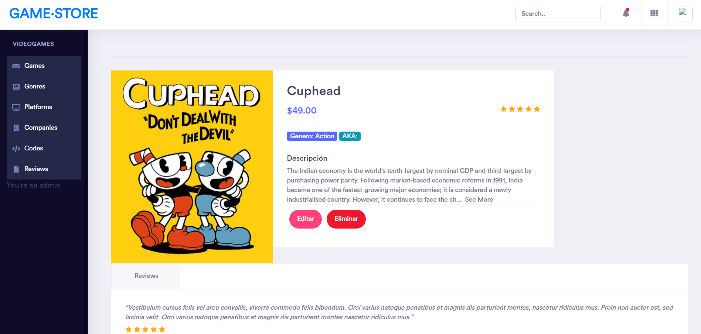

# Laravel VideoGame Store


## Screenshots

### Videogames catalog

### Videogame details and reviews

### Game codes administration


## Installation

### Setup database

In order to run this app in localhost you must setup the database first and populate it with initial data.
You must setup the `gamestore` database first, **I used Postgres in my case:**

```sql
create database gamestore
```
If you want to use another DB name change it in the `.env` file along with credentials

#### Enable driver

Enable the appropriate driver for your database manager. In my case i had to uncomment these lines in the `php.ini` file:
```
extension=pdo_pgsql
extension=pgsql
```

#### Make migrations

```
php artisan migrate
```

#### Populate database

We create some test data to fill the database and make it easier to explore the application, to use that data you must run:
```
php artisan db:seed
```

### Dependencies

Install project dependencies with composer (this can take a long time):
```php
composer install
```

## Start server
```
php artisan serve
```

## Routes

|      View                 |           Folder             |     Asociated View   |
| -----------------------:  | :--------------------------: | :------------------- |
| login.blade.php           | resources/views/vg/auth      | login                |
| game_index.blade.php      | resources/views/vg/game      | games                |
| show_game.blade.php       | resources/views/vg/game      | games/show/{id}      |
| platform_index.blade.php  | resources/views/vg/platform  | platforms            |
| show_platform.blade.php   | resources/views/vg/platform  | platforms/show/{id}  |
| character_index.blade.php | resources/views/vg/character | characters           |
| show_character.blade.php  | resources/views/vg/character | characters/show/{id} |
| company_index.blade.php   | resources/views/vg/company   | companies            |
| show_company.blade.php    | resources/views/vg/company   | companies/show/{id}  |
| review_index.blade.php    | resources/views/vg/review    | reviews              |
| show_review.blade.php     | resources/views/vg/review    | reviews/show/{id}    |
| genre_index.blade.php     | resources/views/vg/genre     | genres               |
| show_genre.blade.php      | resources/views/vg/genre     | genres/show/{id}     |


## License

The Laravel framework is open-sourced software licensed under the [MIT license](https://opensource.org/licenses/MIT).

